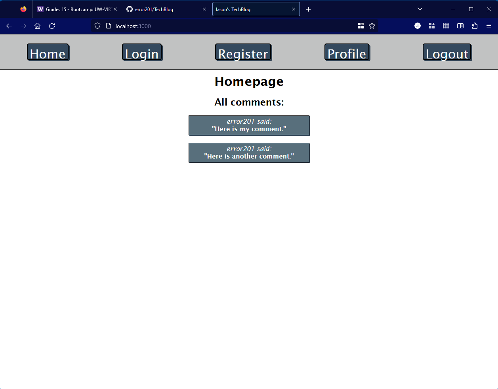

# TechBlog

## Description

This project was an exercise using Handlebars, Node.js, Sequelize, and Express.js. It further reinforced my ability to code routes and front-ends.

## Table of Contents

- [Installation](#installation)
- [Usage](#usage)
- [Credits](#credits)
- [License](#license)

---

## Installation

In a terminal window, type:
```
git clone git@github.com:error201/TechBlog.git
```
Change into the cloned directory, and type the following to install the needed Node.js packages:
```
npm install
```
Rename the file ```.env.example``` to ```.env``` and fill out the data with your own.
In a terminal window, log into your MySQL database, and type the following:
```
source schema.sql
```
To start the server, type the following:
```
node server.js
```

---

## Usage

On first visit, press the ```Register``` button. Enter a name and a password, and you'll be logged in. To add a comment, simply enter your comment in the box and press the ```comment``` button. To see comments from all users, click on the ```Home``` button. To logout, click the ```Logout``` button.





---

## Credits

Several packages and/or libraries were used for this project:
 - [Node.js](https://nodejs.org/en/)
 - [Express.js](https://expressjs.com/)
 - [Sequelize.js](https://sequelize.org/)
 - [Handlebars.js](https://handlebarsjs.com/)

---

## License

This project is licensed under the MIT license. Please see [LICENSE](./LICENSE) for details.

---

## Badges


---

## How to Contribute

Feel free to fork and/or clone this repository!
